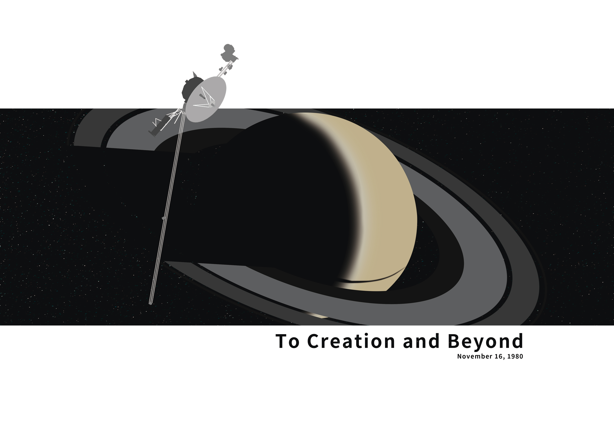
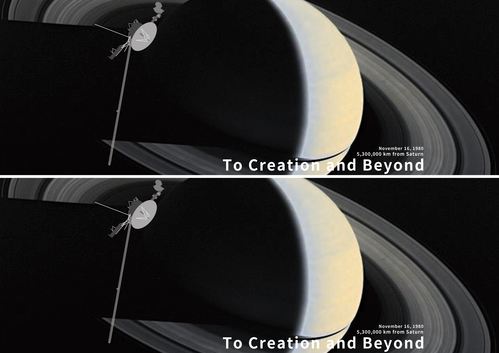

## Basic Information

Image Credit: NASA / JPL-Caltech ([PIA00335](https://science.nasa.gov/photojournal/full-disk-color-image-of-crescent-saturn-with-rings-and-ring-shadows/), Voyager 1)

Dimensions follows standard A3.

CMYK Ready.

## Preview

> Ver. 2

> Ver. 3, another formatting.

## Note

The source files are provided as a multi-part archive. Please download all `.001`, `.002` parts into the same folder to extract.

Early poster, pls excuse me if there is any formatting problem.

Bleeding not included.

## License

This work is licensed under a [Creative Commons Attribution-NonCommercial-ShareAlike 4.0 International License](http://creativecommons.org/licenses/by-nc-sa/4.0/).

[![CC BY-NC-SA 4.0][cc-by-nc-sa-shield]][cc-by-nc-sa]

[cc-by-nc-sa]: http://creativecommons.org/licenses/by-nc-sa/4.0/
[cc-by-nc-sa-shield]: https://img.shields.io/badge/License-CC%20BY--NC--SA%204.0-lightgrey.svg
