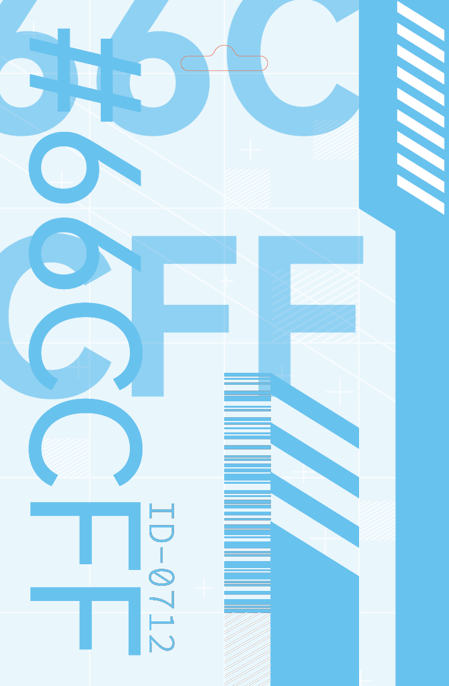

## Basic Information

Dimensions follows standard ISO/IEC 7810 ID-1 format (85.60 mm × 53.98 mm). 

CMYK Ready. 

## Preview

## Note

The source file may not be exactly the same (mainly minor tweaks in stroke weight) as the print-ready files, becuase the lines in the original design were difficult to print out.

## License

This work is licensed under a [Creative Commons Attribution-NonCommercial-ShareAlike 4.0 International License](http://creativecommons.org/licenses/by-nc-sa/4.0/).

[![CC BY-NC-SA 4.0][cc-by-nc-sa-shield]][cc-by-nc-sa]

[cc-by-nc-sa]: http://creativecommons.org/licenses/by-nc-sa/4.0/
[cc-by-nc-sa-shield]: https://img.shields.io/badge/License-CC%20BY--NC--SA%204.0-lightgrey.svg
